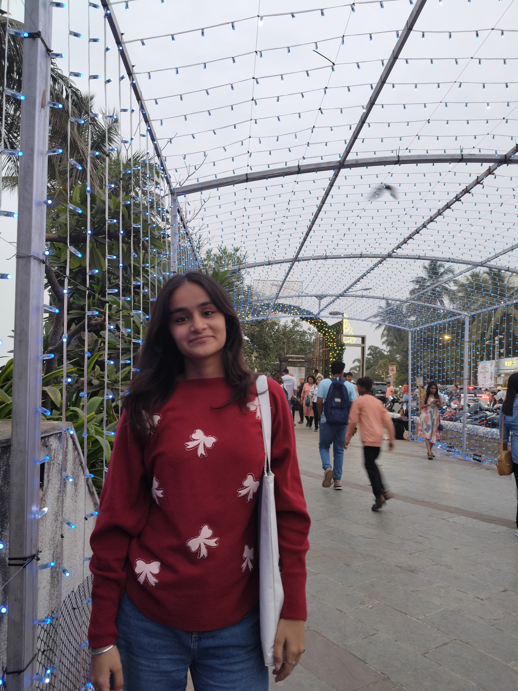

# 🏛️ Vintique Studio

<div align="center">
  
  
  
  
  
</div>

<div align="center">
  <h3>🎨 Where Vintage Meets Modern</h3>
  <p>A stunning portfolio website showcasing the perfect blend of vintage aesthetics with contemporary functionality</p>
</div>

---

## ✨ Features

- 🎭 **Vintage-Modern Design** - Carefully crafted aesthetic combining nostalgic charm with contemporary UX
- 🚀 **Smooth Scrolling** - Powered by Lenis for buttery-smooth performance
- 📱 **Fully Responsive** - Optimized for all devices from mobile to desktop
- 🎪 **3D Interactive Elements** - Spline 3D models for immersive experience
- 🍔 **Animated Hamburger Navigation** - Smooth sidebar menu with elegant transitions
- 🎠 **Infinite Marquees** - Eye-catching animated content sections with hover effects
- 🖼️ **Interactive Project Gallery** - Smooth image hover transitions and overlay effects
- 👥 **Dynamic Team Section** - Floating dialog cards with social links
- 💬 **Testimonials Carousel** - Infinite scrolling client testimonials
- ⏳ **Custom Loading Screen** - Animated progress counter and vintage typography
- 🎯 **Performance Optimized** - Fast loading with modern build tools
- ♿ **Accessible** - Built with accessibility best practices
- 🎨 **Custom Animations** - Micro-interactions and smooth transitions

## 🛠️ Tech Stack

### Frontend Framework
- **React 18.3.1** - Modern React with hooks and concurrent features
- **TypeScript 5.5.3** - Type-safe development experience
- **Vite 5.4.2** - Lightning-fast build tool and dev server

### Styling & UI
- **Tailwind CSS 3.4.1** - Utility-first CSS framework
- **Custom CSS** - Vintage-inspired design system
- **Google Fonts** - Playfair Display & Source Sans Pro typography
- **Lucide React** - Beautiful, customizable icons

### 3D & Animations
- **Spline React 4.1.0** - Interactive 3D models and scenes
- **Lenis 1.0.42** - Smooth scrolling library for performance
- **CSS Animations** - Custom keyframe animations and transitions
- **CSS Grid & Flexbox** - Modern layout systems for responsive design

### Development Tools
- **ESLint** - Code linting and quality assurance
- **PostCSS** - CSS processing and optimization
- **Autoprefixer** - Automatic vendor prefixing

## 🚀 Quick Start

### Prerequisites

Make sure you have the following installed:
- **Node.js** (v18 or higher)
- **npm** or **yarn**

### Installation

1. **Clone the repository**
   ```bash
   git clone https://github.com/panduthegang/Vintique-Studio.git
   cd Vintique-Studio
   ```

2. **Install dependencies**
   ```bash
   npm install
   # or
   yarn install
   ```

3. **Start the development server**
   ```bash
   npm run dev
   # or
   yarn dev
   ```

4. **Open your browser**
   ```
   http://localhost:5173
   ```

### Build for Production

```bash
npm run build
# or
yarn build
```

### Preview Production Build

```bash
npm run preview
# or
yarn preview
```

## 📁 Project Structure

```
vintique-studio/
├── public/                 # Static assets
│   ├── Harsh.jpg          # Team member profile photos
│   ├── Saachi.jpg         # Team member profile photos
│   └── vite.svg
├── src/
│   ├── components/        # React components
│   │   ├── AnimatedNav.tsx          # Hamburger navigation with animated sidebar
│   │   ├── InfiniteMarquee.tsx      # Infinite scrolling feature marquee
│   │   ├── LoadingPage.tsx          # Custom loading screen with progress
│   │   ├── TeamSection.tsx          # Interactive team member showcase
│   │   └── TestimonialsMarquee.tsx  # Client testimonials carousel
│   ├── App.tsx           # Main application component
│   ├── main.tsx          # Application entry point
│   └── index.css         # Global styles & design system
├── tailwind.config.js    # Tailwind configuration
├── vite.config.ts        # Vite configuration
└── tsconfig.json         # TypeScript configuration
```

## 🎨 Design System

### Color Palette
```css
--vintage-cream: #D8C9AE      /* Primary background */
--vintage-charcoal: #575757   /* Text and accents */
--vintage-gold: #B8860B       /* Highlights and CTAs */
--vintage-cream-light: #E5D9C7 /* Light variations */
--vintage-cream-dark: #C5B394  /* Dark variations */
```

### Typography
- **Display Font**: Playfair Display (Headings)
- **Body Font**: Source Sans Pro (Body text)
- **Line Heights**: 150% for body, 120% for headings

### Components
- **Vintage Frames**: Bordered containers with backdrop blur
- **Vintage Buttons**: Custom styled CTAs with hover effects
- **Vintage Cards**: Elevated content containers
- **Interactive Cards**: Project cards with image hover transitions
- **Floating Dialogs**: Team member information cards
- **Animated Navigation**: Hamburger menu with smooth sidebar
- **Marquees**: Infinite scrolling content sections with hover states

## 🎯 Interactive Features

### Navigation System
- **Hamburger Menu**: Animated 3-line hamburger that transforms into an X
- **Sidebar Navigation**: Full-height sidebar with backdrop blur
- **Smooth Scrolling**: Lenis-powered navigation to sections
- **Responsive Design**: Adapts to mobile, tablet, and desktop

### Project Gallery
- **Image Hover Effects**: Smooth transitions between default and hover images
- **Overlay Animations**: "View Project" text appears on hover
- **Card Interactions**: Lift effect and shadow enhancement
- **Technology Tags**: Highlighted tech stack for each project

### Team Section
- **Floating Cards**: Hover-triggered profile information dialogs
- **Social Integration**: Direct links to GitHub, LinkedIn, and email
- **Progressive Disclosure**: Information revealed contextually
- **Mobile Optimization**: Touch-friendly interactions

### Loading Experience
- **Progress Counter**: Real-time loading percentage display
- **Animated Typography**: Staggered text animations
- **Vintage Aesthetics**: Consistent with overall design theme
- **Performance Optimized**: Simulated realistic loading progression

### Testimonials System
- **Infinite Scroll**: Seamless looping testimonial carousel
- **Hover Interactions**: Cards lift and highlight on hover
- **Client Profiles**: Photos, names, roles, and companies
- **Star Ratings**: Visual feedback system

## 🔧 Configuration

### Tailwind CSS
Custom color extensions and component classes are defined in `tailwind.config.js` and `src/index.css`.

### Lenis Smooth Scrolling
Configured for optimal performance with 3D content:
- Duration: 1.2s
- Custom easing function
- Touch optimization
- RAF integration
- Section-based navigation

### Interactive Animations
- **Hover States**: Image transitions, card lifts, and overlays
- **Loading Animations**: Progress counters and text reveals
- **Navigation**: Hamburger transformations and sidebar slides

### Spline 3D Models
Interactive 3D scenes are loaded from Spline cloud:
- Optimized for web performance
- Responsive scaling
- Pointer event management during scroll

### Image Optimization
- **External CDN**: Pexels integration for high-quality images
- **Responsive Images**: Optimized for different screen sizes
- **Lazy Loading**: Performance-optimized image loading
- **Hover Transitions**: Smooth image swapping effects

## 📱 Responsive Design

- **Mobile First**: Designed for mobile devices first
- **Breakpoints**: 
  - `sm`: 640px
  - `md`: 768px
  - `lg`: 1024px
  - `xl`: 1280px
- **Flexible Layouts**: CSS Grid and Flexbox
- **Touch Optimized**: Smooth interactions on touch devices
- **Adaptive Navigation**: Hamburger menu for mobile, full nav for desktop
- **Content Reflow**: Sections adapt gracefully to different screen sizes

## ♿ Accessibility

- **Semantic HTML**: Proper heading hierarchy and landmarks
- **Keyboard Navigation**: Full keyboard accessibility including menu navigation
- **Screen Readers**: ARIA labels and descriptions
- **Color Contrast**: WCAG compliant color ratios
- **Reduced Motion**: Respects user motion preferences
- **Focus Management**: Clear focus indicators and logical tab order
- **Alt Text**: Comprehensive image descriptions

## 🚀 Performance

- **Lazy Loading**: Images and components loaded on demand
- **Code Splitting**: Automatic code splitting with Vite
- **Asset Optimization**: External CDN for images, optimized fonts
- **Smooth Scrolling**: Optimized with Lenis for 60fps
- **3D Optimization**: Efficient 3D model loading
- **CSS Animations**: GPU-accelerated transforms and transitions
- **Loading States**: Progressive content loading with visual feedback

## 🎨 Animation System

### Hover Effects
- **Image Transitions**: Smooth swapping between default and hover images
- **Card Interactions**: Lift effects with enhanced shadows
- **Button States**: Color transitions and scaling effects
- **Icon Animations**: Rotation and scaling on interaction

### Page Transitions
- **Loading Screen**: Animated progress with staggered text reveals
- **Section Navigation**: Smooth scrolling between page sections
- **Menu Animations**: Hamburger transformation and sidebar slide
- **Content Reveals**: Fade-in and slide-up animations

### Marquee Systems
- **Infinite Scroll**: Seamless looping content carousels
- **Hover Pause**: User-controlled animation states
- **Performance**: CSS-based animations for smooth 60fps
- **Responsive**: Adapts speed and sizing for different devices

## 🤝 Contributing

1. Fork the repository
2. Create your feature branch (`git checkout -b feature/amazing-feature`)
3. Commit your changes (`git commit -m 'Add some amazing feature'`)
4. Push to the branch (`git push origin feature/amazing-feature`)
5. Open a Pull Request

## 📄 License

This project is licensed under the MIT License - see the [LICENSE](LICENSE) file for details.

---

<div align="center">
  <h3>🏰 Made with ❤️ by Team House Stark</h3>
  
  <table>
    <tr>
      <td align="center">
        <br />
        <sub><b>Harsh Rathod</b></sub><br />
        <sub>Team Lead Developer</sub><br />
        <a href="https://github.com/harshrathod">🔗 GitHub</a> |
        <a href="https://linkedin.com/in/harshrathod">💼 LinkedIn</a>
      </td>
      <td align="center">
        <br />
        <sub><b>Saachi Desai</b></sub><br />
        <sub>UI/UX Designer</sub><br />
        <a href="https://github.com/saachidesai">🔗 GitHub</a> |
        <a href="https://linkedin.com/in/saachidesai">💼 LinkedIn</a>
      </td>
    </tr>
  </table>
  
  <p><em>"Winter is coming, but great design is timeless."</em></p>
  
  
</div>

---

<div align="center">
  <p>⭐ Star this repository if you found it helpful!</p>
  <p>🐛 Found a bug? <a href="https://github.com/your-username/vintique-studio/issues">Report it here</a></p>
</div>